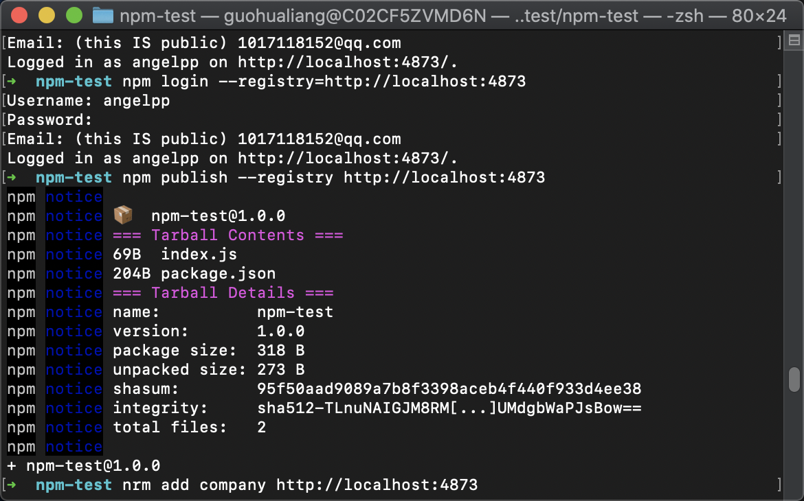
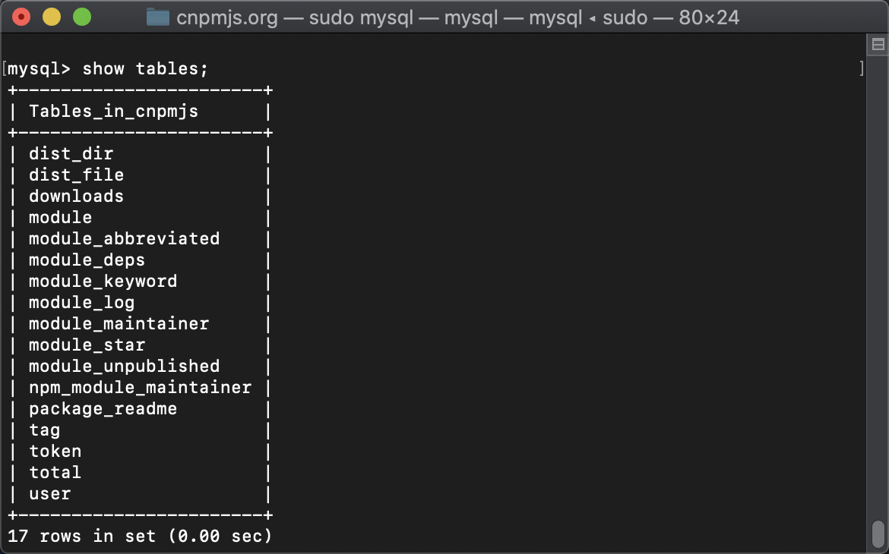
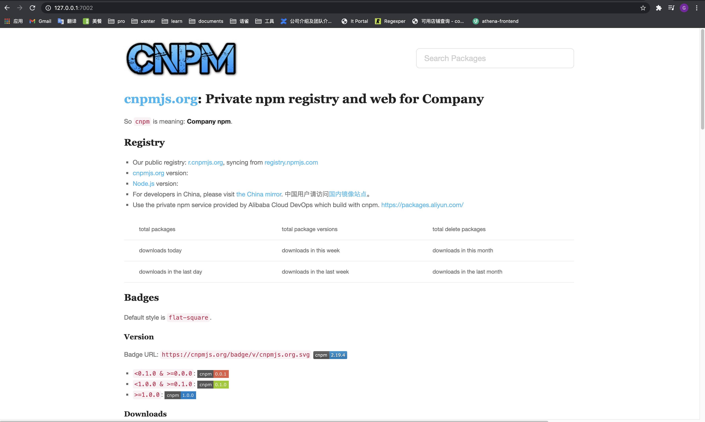

- 添加npm源
```bash
nrm add company http://localhost:4873
```

- 切换源
```bash
nrm use company
```
// 以下操作都会基于当前配置源`registry`
- 添加npm用户
```bash
npm addUser
```

- 登陆npm
```bash
npm login
```

- 发布npm包
```bash
npm publish
```

- 删除已发布的npm包
```bash
npm unpublish npm-test --force #强制清除发布的包
```

- 安装mysql

```bash
brew install mysql 
```

- 启动mysql

```bash
sudo mysql.server start
```

- 登陆mysql

```bash
sudo mysql -u root
```


发布npm包：




Cnpmjs.org数据库：




cnpmjs.org内部网页：

